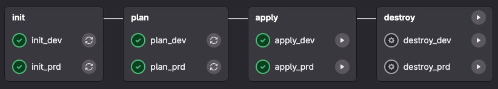

# GitLab / Terraform pipeline

This is a simple configuration to run Terraform jobs in GitLab pipelines for a development and production environment
hosted on Google Cloud, using GitLab-managed Terraform state. 

I use it to deploy a Cloud Run function, that's located in the `src` directory in the project root. The Terraform
infrastructure is located in the `infra` directory, as you can see that in the pipeline.

The apply and destroy jobs are triggered manually.

## Pipeline CI/CD secrets

| Name                    | Value                                                                                    |
|-------------------------|------------------------------------------------------------------------------------------|
| `DEV_GCLOUD_SA_KEY_B64` | Service account key for the development environment.                                     |
| `PRD_GCLOUD_SA_KEY_B64` | Service account key for the production environment.                                      |
| `GITLAB_USERNAME_B64`   | The username of the account used to access the GitLab-managed Terraform state in Base64. |
| `GITLAB_ACCESS_TOKEN`   | Access token for the account used to access the GitLab-managed Terraform state.          |
