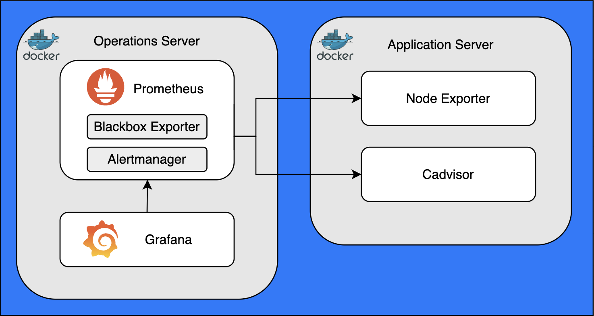
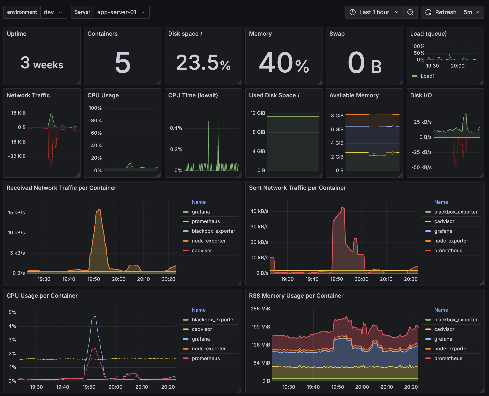

# Prometheus and Grafana Monitoring Stack

This repository provides a template configuration to set up a monitoring infrastructure using Prometheus, Grafana, and various exporters. It assumes a two-server architecture:

- **Operations Server:** Hosts Prometheus, Grafana, and Blackbox Exporter.
- **Applications Server:** Hosts Node Exporter and cAdvisor for system and container metrics.




---
## Disclaimer

This repository is provided "as-is" without any warranties or guarantees of functionality. Use it at your own risk and ensure you test all configurations thoroughly before deploying them in production environments. Contributions and feedback are welcome!

---

*Before you begin, ensure you have Docker installed

---

## Getting Started

### Running Prometheus

To start Prometheus on your operations server, use the `run_prometheus.sh` script:

```yaml
docker run -d -p 9090:9090 --name prometheus \
  -v $(pwd)/prometheus.yml:/etc/prometheus/prometheus.yml \
  -v $(pwd)/prometheus:/prometheus \
  --user $(id -u):$(id -g) \
  prom/prometheus \
  --config.file=/etc/prometheus/prometheus.yml \
  --storage.tsdb.path=/prometheus
```

This script runs Prometheus on port 9090 and mounts the configuration file (`prometheus.yml`) and data directory (`./prometheus`) for persistence.

The `prometheus.yml` file includes scrape configurations for:

- Prometheus itself (localhost:9090)
- Node Exporter (localhost:9100)
- cAdvisor (localhost:9900)
- Blackbox Exporter (probes HTTP/HTTPS targets)

You can modify this file to add or remove scrape jobs as needed.

---

### Running Grafana

To start Grafana on your operations server, use the `run_grafana.sh` script:

```yaml
docker run -d -p 3000:3000 --name=grafana \
  -v $(pwd)/grafana:/var/lib/grafana \
  --user $(id -u):$(id -g) \
  grafana/grafana-enterprise
```
This script runs Grafana on port 3000 and mounts the `./grafana` directory for persistent storage.


## Grafana Dashboard Template

A template dashboard is included in grafana-dashboard_template.json which can be imported into grafana



---

### Running Blackbox exporter
This exporter probes specified targets (e.g., HTTP/HTTPS endpoints) for availability.

To start Blackbox Exporter on your operations server, use the `run_blackbox-exporter.sh` script:

```yaml
docker run -d --rm -p 9115:9115 --name blackbox_exporter \
  quay.io/prometheus/blackbox-exporter:latest
```

---

## Exporters

The following exporters should be started on each of your target servers (applications servers):

### Running Node Exporter

Node Exporter collects system-level metrics. Run it using `exporters/run_node-exporter.sh`:
```yaml
docker run -d \
  --name=node-exporter \
  --net="host" \
  --pid="host" \
  -v "/:/host:ro,rslave" \
  quay.io/prometheus/node-exporter:latest \
  --path.rootfs=/host
```

### Running CAdvisor 

cAdvisor collects container metrics. Run it using`exporters/run_cadvisor.sh`:

```yaml
VERSION=v0.49.1 # use the latest release version from https://github.com/google/cadvisor/releases
sudo docker run \
  --volume=/:/rootfs:ro \
  --volume=/var/run:/var/run:ro \
  --volume=/sys:/sys:ro \
  --volume=/var/lib/docker/:/var/lib/docker:ro \
  --volume=/dev/disk/:/dev/disk:ro \
  --publish=9900:8080 \
  --detach=true \
  --name=cadvisor \
  --privileged \
  --device=/dev/kmsg \
  gcr.io/cadvisor/cadvisor:$VERSION
```

---

### Alerting with Alertmanager
The `alertmanager` directory contains configurations and scripts for setting up Alertmanager. Refer to the [`alertmanager/README.md`](alertmanager/README.md) file for detailed instructions.

### Key Files:
- **alerts.yml**: Predefined alert rules.
- **run_alertmanager.sh**: Script to start Alertmanager in a Docker container.

---

